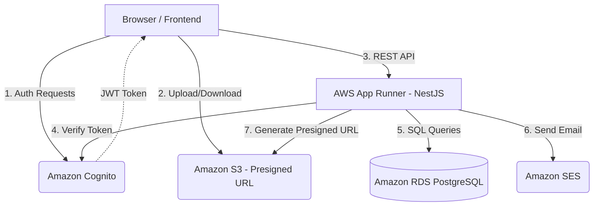

# KIẾN TRÚC HỆ THỐNG (SYSTEM ARCHITECTURE)

Dự án **Startups Blogs** được thiết kế theo kiến trúc Microservices-oriented, trong đó Frontend và Backend được tách biệt hoàn toàn, giao tiếp qua REST API. Toàn bộ hệ thống được triển khai trên hạ tầng AWS.

## 1. Thành phần hệ thống

### 1.1 Client (Frontend)
- **Công nghệ:** React 19, Vite, TypeScript.
- **Hosting:** AWS S3 kết hợp với Amazon CloudFront (CDN) để phân phối nội dung tĩnh (HTML, CSS, JS) với tốc độ cao, độ trễ thấp và hỗ trợ SSL/TLS.
- **Routing:** Client-side routing bằng React Router.

### 1.2 API Server (Backend MVP)
- **Công nghệ:** Node.js, NestJS, TypeScript, Prisma ORM.
- **Hosting:** AWS App Runner. Lý do chọn App Runner cho MVP vì dễ dàng deploy container, tự động scale dựa trên lượng traffic, không tốn công quản trị hạ tầng (serverless container).

### 1.3 Database & Storage
- **Relational DB:** Amazon RDS for PostgreSQL. Chứa các dữ liệu nghiệp vụ (User, Startup, Idea, v.v.). Prisma sẽ kết nối trực tiếp đến đây.
- **Object Storage:** Amazon S3. Lưu trữ logo, hình ảnh, pitch deck. Việc upload/download được xử lý qua **Presigned URLs** để bảo mật và giảm tải cho Backend.

### 1.4 Identity & Authentication
- **Dịch vụ:** Amazon Cognito User Pool.
- **Luồng hoạt động:** 
  - Frontend gọi trực tiếp đến Cognito để Đăng ký / Đăng nhập / Quên mật khẩu.
  - Sau khi đăng nhập, Cognito trả về JWT Token (ID Token, Access Token).
  - Frontend dùng JWT gắn vào header `Authorization: Bearer <token>` để gọi API Backend.
  - Backend sử dụng JWT Guard để verify token, lấy `cognitoSub` và tra cứu quyền hệ thống trong RDS.

### 1.5 Dịch vụ phụ trợ
- **Email:** Amazon SES. Dùng để gửi các email giao dịch ngoài luồng auth (như thông báo hệ thống, Contact Request).
- **Log & Monitor:** Amazon CloudWatch (Logs, Metrics, Alerts cho App Runner và RDS).
- **Security:** AWS Secrets Manager để lưu trữ thông tin nhạy cảm (DB password, API keys).

## 2. Sơ đồ luồng dữ liệu (Data Flow Diagram)

