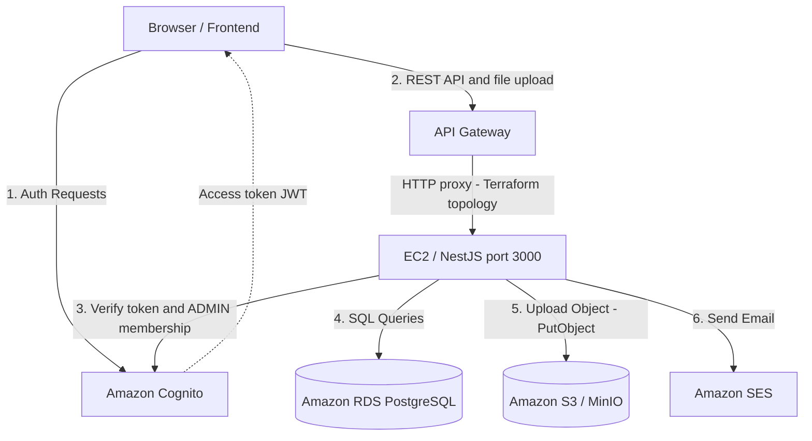

# KIẾN TRÚC HỆ THỐNG (SYSTEM ARCHITECTURE)

Dự án **Startups Blogs** được thiết kế theo kiến trúc Microservices-oriented, trong đó Frontend và Backend được tách biệt hoàn toàn, giao tiếp qua REST API. Toàn bộ hệ thống được triển khai trên hạ tầng AWS.

## 1. Thành phần hệ thống

### 1.1 Client (Frontend)
- **Công nghệ:** React 19, Vite, TypeScript.
- **Hosting:** AWS S3 kết hợp với Amazon CloudFront (CDN) để phân phối nội dung tĩnh (HTML, CSS, JS) với tốc độ cao, độ trễ thấp và hỗ trợ SSL/TLS.
- **Routing:** Client-side routing bằng React Router.

### 1.2 API Server (Backend)
- **Công nghệ:** Node.js, NestJS, TypeScript, Prisma ORM.
- **Topology do Terraform khai báo:** API Gateway dùng HTTP proxy để chuyển request vào backend NestJS trên EC2, cổng `3000`.
- **Trạng thái production:** Frontend production gọi một URL API Gateway cố định; chỉ từ repository chưa thể xác nhận Gateway live đó đang tích hợp với EC2 do state Terraform hiện tại quản lý.
- **Tự động hóa hiện tại:** Workflow `CI` kiểm tra lint, unit test và build backend. Repository không còn workflow ECR/App Runner vì production không sử dụng đường triển khai này.
- **Trước khi phát hành:** Xác minh integration live của API Gateway và quy trình chạy backend trên EC2 trước khi xây dựng CD; không tự động SSH, restart hoặc thay đổi production khi chưa có runbook và cơ chế rollback.

### 1.3 Database & Storage
- **Relational Database:** Production sử dụng Amazon RDS for PostgreSQL. Prisma kết nối tới RDS để lưu dữ liệu nghiệp vụ; PostgreSQL Docker chỉ phục vụ phát triển local khi cần.
- **Object Storage:** Backend nhận file qua `POST /upload` rồi ghi vào dịch vụ tương thích S3. Production có thể dùng Amazon S3; local mặc định dùng MinIO. Luồng hiện tại là backend proxy, chưa phải presigned URL trực tiếp từ trình duyệt.

### 1.4 Identity & Authentication
- **Dịch vụ hiện hành:** Amazon Cognito User Pool.
- **Luồng hoạt động:**
  - Frontend gọi trực tiếp Cognito để đăng ký/đăng nhập và nhận access token JWT.
  - Frontend gửi token qua `Authorization: Bearer <token>` khi gọi backend.
  - Backend xác minh Cognito access token, liên kết user bằng `cognitoSub` và, đối với quyền `ADMIN`, kiểm tra membership hiện thời trong Cognito; không dùng role do frontend gửi lên để cấp quyền.

### 1.5 Dịch vụ phụ trợ
- **Email:** Amazon SES. Dùng để gửi các email giao dịch ngoài luồng auth (như thông báo hệ thống, Contact Request).
- **Log & Monitor:** Terraform khai báo cảnh báo CPU EC2 qua CloudWatch/SNS và dashboard cho metric EC2/RDS; repository chưa khai báo log collection cho API Gateway/EC2 hoặc metric RAM EC2.
- **Security:** AWS Secrets Manager để lưu trữ thông tin nhạy cảm (DB password, API keys).

## 2. Sơ đồ luồng dữ liệu (Data Flow Diagram)

